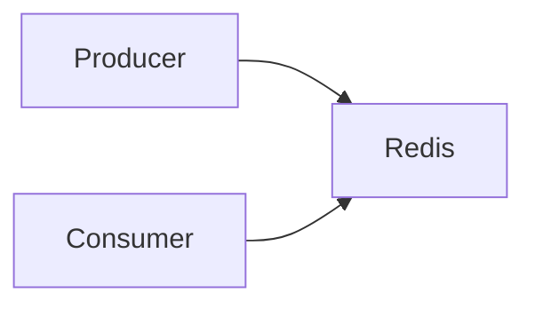

# Message streaming application

### Technologies

- Golang
- Redis streams
- Docker

This application demonstrates a simple producer / consumer stream.

Run with docker.

```bash
docker compose up --build
```

By default this is running with one producer and one consumer.

To increase the number of consumers just change replicas number on consumer service at `docker-compose.yml` file.

```yml
deploy:
  replicas: 1
```

### Graph representation


